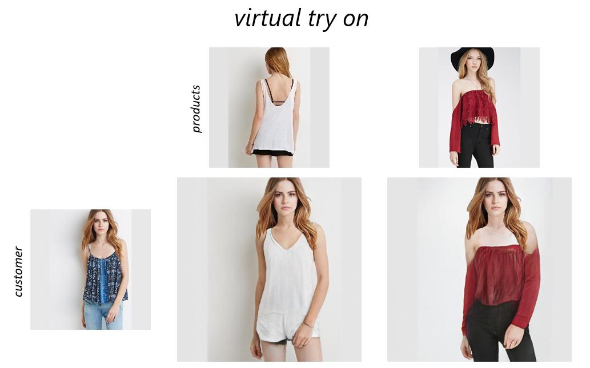

# AI Virtual Try On



Team Members: [Bowen Zhang](https://github.com/ForeverFancy), [Youyi Zhan](https://github.com/1231234zhan), [Chuxin Wang](https://github.com/XinYuan-believe), [Shuxian Bi](https://github.com/GabyUSTC)

Mentors: [Bo Zhang](https://www.microsoft.com/en-us/research/people/zhanbo/), [Bartuer Zhou](https://www.researchgate.net/profile/Bartuer_Zhou)

## Introduction

This is the project of MSRA Advanced Software Engineering Class.

AI-Vitrual-Try-On enables you to try on different clothes without going to the shops in person.

Click [here](http://172.23.234.84/) to get your own try-on photos.

## Deployment

### Backend

#### Installation

```bash
$ python3 -m pip install -r requirements.txt
```

#### Run Backend

```bash
$ python3 manage.py makemigrations BackendManagement
$ python3 manage.py migrate
$ python3 manage.py runserver
```

### Frontend

```bash
$ npm install
$ npm run serve   # Compiles and hot-reloads for development
$ npm run build   # Compiles and minifies for production
```
### Model

TBA.

## Citation

```
@article{Zhang2020CrossdomainCL,
  title={Cross-domain Correspondence Learning for Exemplar-based Image Translation},
  author={Pan Zhang and Bo Zhang and Dong Chen and Lu Yuan and Fang Wen},
  journal={ArXiv},
  year={2020},
  volume={abs/2004.05571}
}

@misc{zhou2020fullresolution,
      title={Full-Resolution Correspondence Learning for Image Translation}, 
      author={Xingran Zhou and Bo Zhang and Ting Zhang and Pan Zhang and Jianmin Bao and Dong Chen and Zhongfei Zhang and Fang Wen},
      year={2020},
      eprint={2012.02047},
      archivePrefix={arXiv},
      primaryClass={cs.CV}
}
```